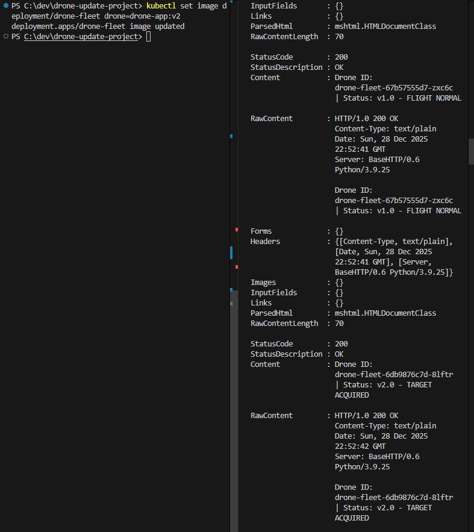

# 🚁 Kubernetes Drone Swarm Simulator (CKA Prep)

A simulation of a "Zero Downtime" firmware update for a UAV fleet, deployed on a local Kubernetes cluster.

## 🎯 The Goal
To demonstrate **Rolling Updates** and **Self-Healing** capabilities in Kubernetes. The challenge was to update the drone firmware from `v1` to `v2` without dropping a single packet from the ground station connection.

## 📸 Proof of Concept


## 🛠️ Tech Stack
* **Python:** Used to simulate the drone's internal telemetry system.
* **Docker:** Containerized the application (v1 and v2 images).
* **Kubernetes:**
    * **Deployments:** Managed the replica set (3 drones).
    * **Readiness Probes:** Ensured `v2` was fully booted before killing `v1`.
    * **Services:** Load balanced traffic to the active pods.

## 🚀 How to Run
1. Build the images:
   ```bash
   docker build -t drone-app:v1 .
   # (Change code to v2)
   docker build -t drone-app:v2 .
   ```
2. Deploy the fleet:
   ```bash
   kubectl apply -f deployment.yaml
   ```
3. Monitor the transition:
   ```bash
   while true; do curl http://localhost:80; sleep 1; don
   ```
4. Trigger the update:
   ```bash
   kubectl set image deployment/drone-fleet drone=drone-app:v2
   ```

